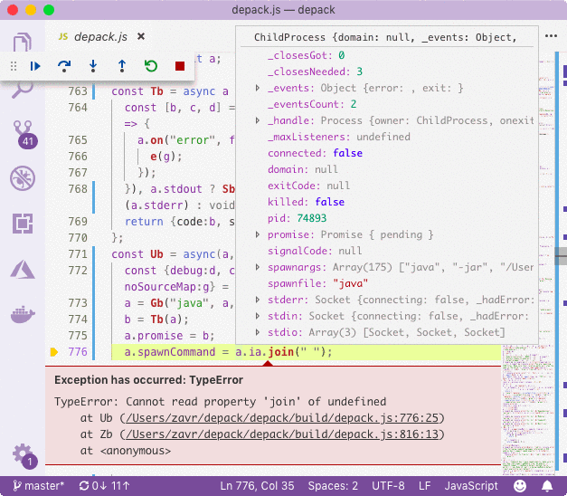

# depack

[](https://npmjs.org/package/depack)

`depack` Is The Bundler To Create Front-End (JS) Bundles And Back-End (Node.JS) Compiled Packages With Google Closure Compiler.

```sh
yarn add -E depack
```

## Table Of Contents

- [Table Of Contents](#table-of-contents)
- [GCC Installation](#gcc-installation)
- [**CLI**](#cli)
- [Bundle Mode](#bundle-mode)
- [Compile Mode](#compile-mode)
  * [Usage](#usage)
  * [CommonJS Compatibility](#commonjs-compatibility)
    * [Single Default Export](#single-default-export)
    * [Using Babel-Compiled CommonJS](#using-babel-compiled-commonjs)
  * [Troubleshooting](#troubleshooting)
    * [Bugs In GCC](#bugs-in-gcc)
    * [External APIs](#external-apis)
- [API](#api)
- [Known Bugs](#known-bugs)
- [Org Structure](#org-structure)
- [Notes](#notes)
- [Copyright](#copyright)

<p align="center"><a href="#table-of-contents"></a></p>

## GCC Installation

Depack has been built to contain no dependencies to prove its concept. [Google Closure Compiler](https://github.com/google/closure-compiler) is not installed by it, because the general use-case is to reuse _Depack_ across many projects, and it does not make sense to download and install _GCC_ in each of them in the `node_modules` folder. Therefore, the recommended way is to install GCC in the home or projects directory, e.g., `/Users/home/user` or `/Users/home/js-projects`. In that way, the single _GCC_ will be accessible from there even when running _Depack_ from a particular project (because Node.js will try to resolve the module by traversing up to the root).

The other way to install _GCC_ is to set the `GOOGLE_CLOSURE_COMPILER` environment variable to point to the compiler, either downloaded from the internet, or built yourself.

<p align="center"><a href="#table-of-contents"></a></p>

## **CLI**

_Depack_ can be used from the command line interface to create bundles or compiled packages for the given entry file.

```sh
depack -h
```

```
Google Closure Compiler-based packager for front and back-end.
https://github.com/dpck/depack
Performs static analysis on the source files to find out all dependencies.
Generic flags: https://github.com/google/closure-compiler/wiki/Flags-and-Options

  depack SOURCE [-c] [-o output.js] [-IO 2018] [-awVvh] [-l LEVEL] [... --generic-args]

	SOURCE            	The source file to build.
	--output, -o      	Where to save the output. STDOUT by default.
	--language_in, -I 	Language Input. Can pass ECMA year.
	--language_out, -O	Language Output. Can pass ECMA year.
	--level, -l       	The optimisation level (generic -O).
	                  	WHITESPACE, SIMPLE (default), ADVANCED
	--advanced, -a    	Turn on advanced optimisation.
	--no-warnings, -w 	Don't print warnings. Same as
	                  	--warning_level QUIET
	--compile, -c     	Set the mode to compilation.
	--verbose, -V     	Print all compiler arguments.
	--pretty-print, -p	Add --formatting=PRETTY_PRINT flag.
	--debug, -d       	Set --print_source_after_each_pass
	                  	and save stderr to the specified file.
	--version, -v     	Show Depack and GCC versions.
	--help, -h        	Print help information.
	--no-sourcemap, -S	Do not add source maps.

BACKEND: Creates a single executable file.
  depack SOURCE -c [-o output.js] [-s]

	--no-strict -s	Remove "use strict" from the output.

  Example:

    depack source.js -c -o bundle.js -I 2018 -O 2018

FRONTEND: Creates a bundle for the web.
  depack SOURCE [-o output.js] [-H]

	-H	Add import { h } from 'preact' to files.

  Example:

    depack source.js -o bundle.js -I 2018 -H
```

_Depack_ supports the following flags for both modes. Any additional arguments that are not recognised, will be passed directly to the compiler.


|       Flag       | Short |                                                                                    Description                                                                                    |
| ---------------- | ----- | --------------------------------------------------------------------------------------------------------------------------------------------------------------------------------- |
| `--output`       | `-o`  | The output path. Will print to `STDOUT` when not specified.                                                                                         |
| `--language_in`  | `-I`  | The version of the language of the input file. Analogues to the original Closure flag, but supports passing just the year to set the ECMA version, e.g., `-I 2018` is acceptable. |
| `--language_out` | `-O`  | The version of the language of the output file. The year can also be passed.                                                                                                      |
| `--level`        | `-l`  | The optimisation level, which is the same as passing the Closure's `-O` flag. Can be `WHITESPACE`, `SIMPLE` and `ADVANCED`. |
| `--advanced`     | `-a`  | Sets the optimisation level to `ADVANCED`, i.e., the shortcut for `--level ADVANCED`                                            |
| `--no-warnings`  | `-w`  | Suppresses the warnings.                                                                                                                                                          |
| `--verbose`      | `-V`  | Prints the raw command line arguments passed to the compiler.                                                                                                                     |
| `--no-sourcemap` | `-S`  | Disable generation of the source maps.                                                                                                                                            |
| `--version`      | `-v`  | Displays the _Depack_ version.                                                                                                                                                    |
| `--help`         | `-h`  | Show the help information about the usage.                                                                                                                                        |

<p align="center"><a href="#table-of-contents"></a></p>

## Bundle Mode

The bundle mode is used to create front-end bundles. It discovers all imported dependencies in the project.

<p align="center"><a href="#table-of-contents"></a></p>

## Compile Mode

The **compile** mode is used to create Node.JS executable binaries. This is useful when a program might have many dependencies and it is desirable to publish the package without specifying any of them in the `"dependencies"` field of the `package.json` to speed up the install time and reduce the overall linking time in the package.

_Depack_ will recursively scan the files to detect `import from` and `export from` statements to construct the dependency list since the Google Closure Compile requires to pass all files (both source and paths to `package.json`s) used in compilation as arguments. Whenever an external dependency is detected, its `package.json` is inspected to find out either the `module` or `main` fields. In case when the `main` is found, the additional `--process_common_js_modules` will be set.

The main problem that _Depack_ solves is allowing to require internal Node.JS modules, e.g., `import { createReadStream } from 'fs'`. Traditionally, this was impossible because the compiler does not know about these modules and there is no way to pass the location of their `package.json` files. The strategy adopted by this software is to create proxies for internal packages in `node_modules` folder, for example:

```js
// node_modules/child_process/index.js
export default child_process
export const {
  ChildProcess,
  exec,
  execFile,
  execFileSync,
  execSync,
  fork,
  spawn,
  spawnSync,
} = child_process
```

```json5
// node_modules/child_process/package.json
{
  "name": "child_process",
  "main": "index.js"
}
```

The externs for internal modules are then passed in the arguments list, allowing the compiler to know how to optimise them. Finally, the wrapper is added to prepend the output of the compiler with the actual require calls:

```js
const path = require('path');
const child_process = require('child_process');
const vm = require('vm');
const _module = require('module'); // special case
%output%
```

There is another step which involves patching the dependencies which specify their `main` and `module` fields as the path to the directory rather than the file, which [GCC does not understand](https://github.com/google/closure-compiler/issues/3149).

Put all together, to compile the following file that contains different kinds of modules:

```js
import { createReadStream } from 'fs' // NodeJS module
import loading from 'indicatrix' // Dependency

const load = async () => {
  const packageJson = require.resolve('depack/package.json')
  const rs = createReadStream(packageJson)
  const depack = await new Promise((r) => {
    const d = []
    rs.on('data', data => d.push(data))
    rs.on('close', () => r(d.join('')))
  })
  const { 'version': version } = JSON.parse(depack)
  return version
}
const run = async () => {
  const l = load()
  const version = await loading('Depack version is loading', l)
  console.log(version)
}
(async () => {
  await run()
})()
```

The next _Depack_ command can be used:

```sh
depack example/example.js -c -V -a -w -p
# -c:      set mode to compile
# -V:      verbose output to print all flags and options
# -a:      allow for advanced compilation
# -w:      don't print warnings
# -p:      add formatting PRETTY_PRINT

# [-I 2018]: (default) set source code language to ECMA2018
# [-O 2017]: (default) set output language to ECMA2017
```

```
-jar /Users/zavr/node_modules/google-closure-compiler-java/compiler.jar --compilation_level ADVANCED --language_out ECMASCRIPT_2017 --formatting PRETTY_PRINT --warning_level QUIET --package_json_entry_names module,main --entry_point example/example.js --externs ../src/node_modules/@depack/externs/v8/fs.js --externs ../src/node_modules/@depack/externs/v8/stream.js --externs ../src/node_modules/@depack/externs/v8/events.js --externs ../src/node_modules/@depack/externs/v8/url.js --externs ../src/node_modules/@depack/externs/v8/global.js --externs ../src/node_modules/@depack/externs/v8/global/buffer.js --externs ../src/node_modules/@depack/externs/v8/nodejs.js --module_resolution NODE --output_wrapper #!/usr/bin/env node
'use strict';
const fs = require('fs');%output% --js node_modules/indicatrix/package.json node_modules/indicatrix/src/index.js node_modules/fs/package.json node_modules/fs/index.js example/example.js
Running Google Closure Compiler 20190325...         
```
```js
#!/usr/bin/env node
'use strict';
const fs = require('fs');             
const {createReadStream:g} = fs;
async function h(a) {
  const {interval:d = 250, writable:e = process.stdout} = {};
  a = "function" == typeof a ? a() : a;
  const b = e.write.bind(e);
  let c = 1, f = `${"Depack version is loading"}${".".repeat(c)}`;
  b(f);
  const k = setInterval(() => {
    c = (c + 1) % 4;
    f = `${"Depack version is loading"}${".".repeat(c)}`;
    b(`\r${" ".repeat(28)}\r`);
    b(f);
  }, d);
  try {
    return await a;
  } finally {
    clearInterval(k), b(`\r${" ".repeat(28)}\r`);
  }
}
;const l = async() => {
  var a = require.resolve("depack/package.json");
  const d = g(a);
  a = await new Promise(e => {
    const b = [];
    d.on("data", c => b.push(c));
    d.on("close", () => e(b.join("")));
  });
  ({version:a} = JSON.parse(a));
  return a;
}, m = async() => {
  var a = l();
  a = await h(a);
  console.log(a);
};
(async() => {
  await m();
})();
```

<p align="center"><a href="#table-of-contents"></a></p>

### Usage

There are _Depack_ specific flags that can be passed when compiling a Node.JS executable. These are:


|        Flag         |                      Description                       |
| ------------------- | ------------------------------------------------------ |
| `--compile`, `-c`   | Enables the compilation mode.                          |
| `--no-strict`, `-s` | Removes the `'use strict';` statement from the output. |

<p align="center"><a href="#table-of-contents"></a></p>

### CommonJS Compatibility

Depack works best with ES6 modules. All new code should be written with `import/export` statements because it's the standard that takes the implementations away from hacking assignments to `module.exports` which people used to use in a variety of possibly imaginable ways, e.g.,

<details>
<summary>Show <code>lazyProperty</code> use from <code>depd</code></summary>

```js
lazyProperty(module.exports, 'eventListenerCount', function eventListenerCount () {
  return EventEmitter.listenerCount || require('./event-listener-count')
})

/**
 * Define a lazy property.
 */

function lazyProperty (obj, prop, getter) {
  function get () {
    var val = getter()

    Object.defineProperty(obj, prop, {
      configurable: true,
      enumerable: true,
      value: val
    })

    return val
  }

  Object.defineProperty(obj, prop, {
    configurable: true,
    enumerable: true,
    get: get
  })
}
```
</summary>
</details>

<details>
<summary>Show <code>module.exports</code> use from <code>debug</code></summary>

```js
module.exports = require('./common')(exports);

const {formatters} = module.exports;
```
</summary>
</details>

No offense to the authors of this code, maybe it was fine before the modules were here. Since 2018 everyone absolutely must use modules when writing new JavaScript code. It makes the correct static analysis of programs possible since exports now are not some random object, but a set of APIs, i.e., `default` and `named` exports. When every single dependency of the compiled file is a module, there are no issues or special things to think about. However, when a package tries to use a CommonJS module, there are the following compatibility rules dictated by the _GCC_.

#### Single Default Export

A CommonJS package required from an Ecma module will have only a single default export, accessible via the `default` property. There are no named exports. What you have to do is this:

```js
import commonJs from 'common-js'
commonJs.default('hello')
commonJs.default.named('world')
```

Yes it's crazy. Yes you know what you're doing when importing a package. But thank the _Node.JS_ authors for making this decision. I don't know how you are going to program now, because programming involves using IDE for hints, and then testing before the actual build process, and these 2 things are not satisfied, by either _VSCode_ which does not show hints for `commonJs.default` and `commonJs.default.named`, or _Babel_ which is usually setup for testing.

```js
// ecma
import commonJs from './common-js'

console.log('requiring a common js from ecma:')
console.log(commonJs)
```
```js
// common-js
const commonJs2 = require('./common-js2')

module.exports = () => {
  console.log('default common js export')
}
module.exports['named'] = () => {
  console.log('named common js export')
}

console.log('requiring a common js from common js:')
console.log(commonJs2)
```
```js
// common-js
module.exports = () => {
  console.log('default common js export2')
}
module.exports['named'] = () => {
  console.log('named common js export2')
}
```

<details>
<summary>Show Compiled Version</summary>

```js
'use strict';
var a = () => {
  console.log("default common js export2");
};
a.named = () => {
  console.log("named common js export2");
};
var b = {default:() => {
  console.log("default common js export");
}};
b.default.named = () => {
  console.log("named common js export");
};
console.log("requiring a common js from common js:");
console.log(a);
console.log("requiring a common js from ecma:");
console.log(b);
```
</details>

```js
requiring a common js from common js:
{ [Function: a] named: [Function] }
requiring a common js from ecma:
{ default: { [Function: default] named: [Function] } }
```

#### Using Babel-Compiled CommonJS

Having to write `default` and `default.named` is only half the trouble. Things get really rough when we want to reference packages that were compiled with _Babel_. If we actually follow the standard set by _GCC_ where the the _CommonJS_ only has a default export, we run into interesting developments when trying to use _Babel_-compiled modules. See the examples below.

 <table>
<tr>
<th>Source (<a href="https://github.com/a-la/fixture-babel/blob/master/src/index.js">@a-la/fixture-babel</a>)</th><th>Babel-<a href="https://github.com/a-la/fixture-babel/blob/master/build/index.js">compiled</a></th>
</tr>
<tr>
<td>

```js
/**
 * A function that returns `erte`.
 */
const erte = () => {
  return 'erte'
}

/**
 * A function that returns `c`.
 */
export const c = () => {
  return 'c'
}

/**
 * A function that returns `b`.
 */
export const b = () => {
  return 'b'
}

export default erte
```
</td>
<td>

```js
"use strict";

Object.defineProperty(exports, "__esModule", {
  value: true
});
exports.default = exports.b = exports.c = void 0;

/**
 * A function that returns `erte`.
 */
const erte = () => {
  return 'erte';
};
/**
 * A function that returns `c`.
 */


const c = () => {
  return 'c';
};
/**
 * A function that returns `b`.
 */


exports.c = c;

const b = () => {
  return 'b';
};

exports.b = b;
var _default = erte;
exports.default = _default;
```
</td>
</tr>
</table>

Because _Babel_ sets the `default` property on the `export` property (along with the `_esModule` flag so that other Babel-compiled packages can import it after the run-time evaluation from `_interopRequire`). What is actually happening now, is that to access the default export, we need to say `default.default`, and all named exports, `default.default.named`.

_Script to compile Babel-compatible modules with GCC is now:_

```js
import erte from '@a-la/fixture-babel'

console.log(erte.default.default())
console.log(erte.default.c())
console.log(erte.default.b())
```

_Command:_

```
java -jar /Users/zavr/node_modules/google-closure-compiler-java/compiler.jar \
--compilation_level ADVANCED --language_out ECMASCRIPT_2017 --formatting PRETTY_PRINT \
--process_common_js_modules --package_json_entry_names module,main --entry_point \
example/babel.js --externs ../src/node_modules/@depack/externs/v8/global.js --externs \
../src/node_modules/@depack/externs/v8/global/buffer.js --externs \
../src/node_modules/@depack/externs/v8/nodejs.js
Dependencies: @a-la/fixture-babel
node_modules/@a-la/fixture-babel/build/index.js:6: WARNING - assignment to property b of module$node_modules$$a_la$fixture_babel$build$index.default
found   : undefined
required: function(): ?
exports.default = exports.b = exports.c = void 0;
                  ^^^^^^^^^^^^^^^^^^^^^^^^^^^^^^

node_modules/@a-la/fixture-babel/build/index.js:6: WARNING - assignment to property c of module$node_modules$$a_la$fixture_babel$build$index.default
found   : undefined
required: function(): ?
exports.default = exports.b = exports.c = void 0;
                              ^^^^^^^^^^^^^^^^^^

0 error(s), 2 warning(s), 97.3% typed

```
```js
'use strict';
var a = {};
Object.defineProperty(a, "__esModule", {value:!0});
a.default = a.a = a.b = void 0;
a.b = () => "c";
a.a = () => "b";
a.default = () => "erte";
console.log(a.default());
console.log(a.b());
console.log(a.a());
```

_Trying to execute the output:_

```js
erte
c
b
```

<p align="center"><a href="#table-of-contents"></a></p>

### Troubleshooting

There are going to be times when the program generated with _GCC_ does not work. The most common error that one would get is going to be similar to the following one:

```js
TypeError: Cannot read property 'join' of undefined
    at Ub (/Users/zavr/depack/depack/build/depack.js:776:25)
    at Zb (/Users/zavr/depack/depack/build/depack.js:816:13)
    at <anonymous>
```

This means the compiler has mangled some property on either the built-in _Node.JS_ or external module that broke the contract with the API. This could have happened due to the incorrect/out-of-date externs that are used in _Depack_. In our case, we tried to access the `spawnargs` property on the _ChildProcess_ in the `spawncommand` package, but it was undocumented, therefore the externs did not contain a record of it.

```js
const proc = spawn(command, args, options)
proc.spawnCommand = proc.spawnargs.join(' ')
```

The compiler will typically produce a warning when it does not know about referenced properties which is an indicator that you might end up with runtime errors:

```js
node_modules/@depack/depack/node_modules/spawncommand/src/index.js:54:
WARNING - Property spawnargs never defined on _spawncommand.ChildProcessWithPromise
  proc.spawnCommand = proc.spawnargs.join(' ')
                           ^^^^^^^^^
```

It might be difficult to understand where the problem is coming from when the source is obfuscated, especially when using external packages that the developer is not familiar with. To uncover where the problem really happens, one needs to compile the file without the source map and with pretty-print formatting using the `-S -p` options, and setup the debug launch configuration to stop at the point where the error happens:

```json
{
  "type": "node",
  "request": "launch",
  "name": "Launch Transform",
  "program": "${workspaceFolder}/output/transform.js",
  "console": "integratedTerminal",
  "skipFiles": [
    "<node_internals>/**/*.js"
  ]
},
```



When the program is stopped there, it is required to hover over the parent of the object property that does not exist and see what class it belongs to. Once it's been identified, the source of the error should be understood which leads to the last step of updating the externs.

> Compiling without source maps will show how the property was mangled, however adding the source maps will point to the location of the problem precisely. However, in this particular case the source maps didn't even work for us.

We've found out that `spawnargs` was mangled because it was not defined in the externs files. There can be two reasons:

- firstly, incomplete externs. The solution in the first case is to fork and patch [_Depack/`externs`_](https://github.com/dpck/externs) and link them in your project. It is also possible to can create a separate externs file, where the API is extended, e.g.,
    ```js
    // externs.js
    /** @type {!Array<string>} */
    child_process.ChildProcess.prototype.spawnargs;
    ```
    The program can then be compiled again by pointing to the externs file with the `--externs` flag:
    ```sh
    depack source.js -c -a --externs externs.js
    ```
- secondly, using undocumented APIs. Fixed by not using these APIs, or to access the properties using the bracket notation suck as `proc['spawnargs']`.

<p align="center"><a href="#table-of-contents"></a></p>

#### Bugs In GCC

In might be the case that externs are fine, but the _Google Closure Compiler_ has a bug in it which leads to incorrect optimisation and breaking of the program. These cases are probably rare, but might happen. If this is so, you need to compile without `-a` (ADVANCED optimisation) flag, which will mean that the output is very large. Then you can try to investigate what went wrong with the compiler by narrowing down on the area where the error happens and trying to replicate it in a separate file, and using `-d debug.txt` _Depack_ option when compiling that file to save the output of each pass to the `debug.txt` file, then pasting the code from each step in there to _Node.JS_ REPL and seeing if it outputs correct results.

<p align="center"><a href="#table-of-contents"></a></p>

#### External APIs

When reading and writing files from the filesystem such as a `package.json` files, or loading JSON data from the 3rd party APIs, their properties must be referred to using the quoted notation, e.g.,

```js
// reading
const content = await read(packageJson)
const {
  'module': mod,
  'version': version,
} = JSON.parse(f)

// writing
await write('package.json', {
  'module': 'test/index.mjs',
})

// loading API
const { 'results': results } = await request('https://service.co/api')
```

because otherwise the properties' names get changed by the compiler and the result will not be what you expected it to be. In case of loading external APIs, it's a good idea to create an extern file and defining the known properties there:

<table>
<tr><th>Externs</th><th>Source</th></tr>
<tr><td>

```js
// externs/api.js
/** @const */
var _externalAPI
/** @type {!Array<string>} */
_externalAPI.results
```
</td><td>

```js
// source.js
const { results } = /** @type {_externalAPI} */ ( // cast the type
  await request('https://service.co/api')
)
```
</td>
</table>


<p align="center"><a href="#table-of-contents"></a></p>

## API

This package only publishes a binary. The API is available via the [_@Depack/depack_](https://github.com/dpck/src) package.

```js
import { Bundle, Compile } from '@depack/depack'

(async () => {
  await Bundle(...)
  await Compile(...)
})
```

<p align="center"><a href="#table-of-contents"></a></p>

## Known Bugs

There are a few insignificant known issues with _Google Closure Compiler_.

1. Cannot do `import '.'`: change to `import './'`.
    ```js
    // dot.js
    import test from '.'
    test()
    ```
    ```js
    // index.js
    export default () => {
      console.log('test')
    }
    ```
    <details>
    <summary>Show Dot Error</summary>

    ```
    Exit code 1
    example/bugs/dot.js:2: ERROR - Failed to load module "."
    import test from '.'
    ^
    
    1 error(s), 0 warning(s)
    
    ```
    </details>
1. `node_modules` are not looked up higher than the `cwd`.
1. Cannot import _json_ files. Use `require`.
    ```js
    import data from './data.json'
    console.log(data)
    ```
    <details>
    <summary>Show JSON Error</summary>

    ```
    Exit code 254
    java.lang.RuntimeException: INTERNAL COMPILER ERROR.
    Please report this problem.
    
    INTERNAL COMPILER ERROR.
    Please report this problem.
    
    null
      Node(NAME data): example/bugs/json.js:2:12
    console.log(data)
      Parent(CALL): example/bugs/json.js:2:0
    console.log(data)
    
      Node(SCRIPT): example/bugs/json.js:1:0
    import data from './data.json'
      Parent(ROOT): [source unknown]
    
    	at com.google.javascript.jscomp.NodeUtil.newQName(NodeUtil.java:4014)
    	at com.google.javascript.jscomp.ModuleRenaming.replace(ModuleRenaming.java:207)
    	at com.google.javascript.jscomp.Es6RewriteModules$RenameGlobalVars.visit(Es6RewriteModules.java:867)
    	at com.google.javascript.jscomp.NodeTraversal.traverseBranch(NodeTraversal.java:887)
    	at com.google.javascript.jscomp.NodeTraversal.traverseChildren(NodeTraversal.java:999)
    	at com.google.javascript.jscomp.NodeTraversal.traverseBranch(NodeTraversal.java:883)
    	at com.google.javascript.jscomp.NodeTraversal.traverseChildren(NodeTraversal.java:999)
    	at com.google.javascript.jscomp.NodeTraversal.traverseBranch(NodeTraversal.java:883)
    	at com.google.javascript.jscomp.NodeTraversal.traverseChildren(NodeTraversal.java:999)
    	at com.google.javascript.jscomp.NodeTraversal.handleScript(NodeTraversal.java:837)
    	at com.google.javascript.jscomp.NodeTraversal.traverseBranch(NodeTraversal.java:862)
    	at com.google.javascript.jscomp.NodeTraversal.traverse(NodeTraversal.java:371)
    	at com.google.javascript.jscomp.NodeTraversal.traverse(NodeTraversal.java:381)
    	at com.google.javascript.jscomp.Es6RewriteModules.visitScript(Es6RewriteModules.java:549)
    	at com.google.javascript.jscomp.Es6RewriteModules.visit(Es6RewriteModules.java:378)
    	at com.google.javascript.jscomp.NodeTraversal.handleScript(NodeTraversal.java:839)
    	at com.google.javascript.jscomp.NodeTraversal.traverseBranch(NodeTraversal.java:862)
    	at com.google.javascript.jscomp.NodeTraversal.traverse(NodeTraversal.java:371)
    	at com.google.javascript.jscomp.NodeTraversal.traverse(NodeTraversal.java:381)
    	at com.google.javascript.jscomp.Es6RewriteModules.processFile(Es6RewriteModules.java:186)
    	at com.google.javascript.jscomp.Es6RewriteModules.hotSwapScript(Es6RewriteModules.java:175)
    	at com.google.javascript.jscomp.Es6RewriteModules.process(Es6RewriteModules.java:164)
    	at com.google.javascript.jscomp.PhaseOptimizer$NamedPass.process(PhaseOptimizer.java:328)
    	at com.google.javascript.jscomp.PhaseOptimizer.process(PhaseOptimizer.java:237)
    	at com.google.javascript.jscomp.Compiler.check(Compiler.java:1021)
    	at com.google.javascript.jscomp.Compiler.performChecksAndTranspilation(Compiler.java:829)
    	at com.google.javascript.jscomp.Compiler.lambda$stage1Passes$0(Compiler.java:759)
    	at com.google.javascript.jscomp.CompilerExecutor$2.call(CompilerExecutor.java:102)
    	at java.util.concurrent.FutureTask.run(FutureTask.java:266)
    	at java.util.concurrent.ThreadPoolExecutor.runWorker(ThreadPoolExecutor.java:1149)
    	at java.util.concurrent.ThreadPoolExecutor$Worker.run(ThreadPoolExecutor.java:624)
    	at java.lang.Thread.run(Thread.java:748)
    Caused by: java.lang.RuntimeException: INTERNAL COMPILER ERROR.
    Please report this problem.
    
    null
      Node(NAME data): example/bugs/json.js:2:12
    console.log(data)
      Parent(CALL): example/bugs/json.js:2:0
    console.log(data)
    
    	... 32 more
    Caused by: java.lang.NullPointerException
    	... 32 more
    
    ```
    </details>

<p align="center"><a href="#table-of-contents"></a></p>

## Org Structure

- [[**dpck**](https://github.com/dpck)] The GitHub org.
- [[**@depack**](https://npmjs.com/org/depack)] The NPM scope.
- [[@depack/form](https://dpck.github.io/form/)] Bootstrap Form.
- [[@depack/router](https://dpck.github.io/router/)] Front-end router.
- [[@depack/render](https://github.com/dpck/render)] Render server-side HTML from JSX.
- [[@depack/context](https://github.com/dpck/context)] Testing context for unit-testing.

<p align="center"><a href="#table-of-contents"></a></p>

## Notes

- The static analysis might discover built-in and other modules even if they were not used, since no tree-shaking is performed.
- [2 March 2019] Current bug does not let compile later `jsx` detection. Trying to compile front-end bundler with _Depack_.

<p align="center"><a href="#table-of-contents"></a></p>

## Copyright

<table>
  <tr>
    <th>
      <a href="https://artd.eco">
        
      </a>
    </th>
    <th>© <a href="https://artd.eco">Art Deco</a> for <a href="https://artd.eco/depack">Depack</a> 2019</th>
    <th>
      <a href="https://www.technation.sucks" title="Tech Nation Visa">
        
      </a>
    </th>
    <th><a href="https://www.technation.sucks">Tech Nation Visa Sucks</a></th>
  </tr>
</table>

<p align="center"><a href="#table-of-contents"></a></p>